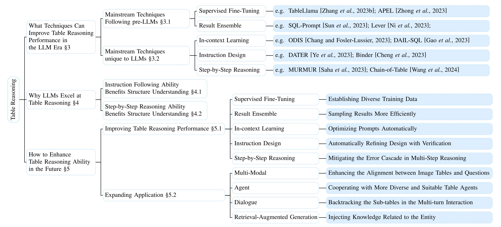

# Awesome-TableReasoning-LLM-Survey
 

This repository contains a list of papers, datasets and leaderboards of the table reasoning task based on the Large Language Models (LLMs), which is carefully and comprehensively organized. If you found any error, please open an issue or pull request.

For more details, please refer to the paper: <a href="https://arxiv.org/abs/2402.08259" target="_blank">A Survey of Table Reasoning with Large Language Models</a>, the overview of which is shown in the figure below.




## Introduction

In a table reasoning task, the inputs to the model include the table, optionally a text description of the table, and the user question that corresponds to variable tasks (e.g., table QA, table fact verification, table-to-text, and text-to-SQL), and the outputs are the answers of the task.
Recent research has shown that LLMs exhibit compelling performance across NLP tasks, in particular, the ability of in-context learning without large-scale data fine-tuning dramatically reduces annotation requirements, which we call the LLM era.
Considering the high annotation and training overheads of table reasoning, there has been a lot of work on applying LLMs to table reasoning tasks to reduce the overheads, which has become the current mainstream method.

## Benchmarks and Leaderboard
In this part, we present leadboards of currect mainstream benchmarks of table reasoning with LLMs.
Each benchmark is ordered by the performance.
**Type** denotes the reasoning types:
* PLM-SOTA: the best performance of small-scale PLMs;
* LLM-fine-tuned: fine-tuning LLMs;
* LLM-few-shot: inference using LLMs with few-shot.

### <a href="https://ppasupat.github.io/WikiTableQuestions/" target="_blank">WikiTableQuestions</a>
WikiTableQuestions serves as the initial benchmark in the table QA task, which has open-domain tables accompanied by complex questions.
<table border="1">
  <!-- <tr>
    <td align=center rowspan="1" colspan="7"><a href="https://ppasupat.github.io/WikiTableQuestions/" target="_blank">WikiTableQuestions</a></td>
  </tr> -->
  <tr>
    <th>Type</th>
    <th>Method</th>
    <th>Organization</th>
    <th>Model</th>
    <th>Setting</th>
    <th>Dev-EM</th>
    <th>Test-EM</th>
    <th>Published Date</th>
  </tr>
  <tr>
    <td>PLM-SOTA</td>
    <td><a href="https://arxiv.org/abs/2207.03637" target="_blank">OmniTab</a></td>
    <td>CMU + Microsoft Azure AI</td>
    <td>TAPEX (BART)</td>
    <td>In-Domain</td>
    <td>-</td>
    <td>62.8</td>
    <td>2022.07</td>
  </tr>
  <tr>
    <td>LLM-fine-tuned</td>
    <td><a href="https://arxiv.org/abs/2311.09206" target="_blank">TableLlama</a></td>
    <td>OSU</td>
    <td>LongLoRA-7B(Llama-2-7B)</td>
    <td>In-Domain</td>
    <td>-</td>
    <td>31.6</td>
    <td>2023.11</td>
  </tr>
  <tr>
    <td rowspan="13" colspan="1">LLM-few-shot</td>
    <td><a href="https://arxiv.org/abs/2310.00815" target="_blank">ReAcTable</a></td>
    <td>Microsoft</td>
    <td>code-davinci-002</td>
    <td>In-Domain</td>
    <td>-</td>
    <td>68.0</td>
    <td>2023.10</td>
  </tr>
    <tr>
    <td><a href="https://arxiv.org/pdf/2401.04398.pdf" target="_blank">Chain-of-Table</a></td>
    <td>Google</td>
    <td>PaLM 2-S</td>
    <td>In-Domain</td>
    <td>-</td>
    <td>67.3</td>
    <td>2024.01</td>
  </tr>
  <tr>
    <td><a href="https://arxiv.org/abs/2301.13808" target="_blank">Dater</a></td>
    <td>USTC & Alibaba Group</td>
    <td>code-davinci-002</td>
    <td>In-Domain</td>
    <td>64.8</td>
    <td>65.9</td>
    <td>2023.01</td>
  </tr>
  <tr>
    <td><a href="https://arxiv.org/abs/2302.08468" target="_blank">Lever</a></td>
    <td>Yale & Meta AI</td>
    <td>code-davinci-002</td>
    <td>In-Domain</td>
    <td>64.6</td>
    <td>65.8</td>
    <td>2023.02</td>
  </tr>
  <tr>
    <td><a href="https://arxiv.org/abs/2210.02875" target="_blank">Binder</a></td>
    <td>HKU</td>
    <td>code-davinci-002</td>
    <td>In-Domain</td>
    <td>65.0</td>
    <td>64.6</td>
    <td>2022.10</td>
  </tr>
  <tr>
    <td><a href="https://openreview.net/forum?id=Qa0ULgosc9" target="_blank">OpenTab                                                        </a></td>
    <td>UMD</td>
    <td>gpt-3.5-turbo-16k</td>
    <td>Open-Domain</td>
    <td>-</td>
    <td>64.1</td>
    <td>2024.01</td>
  </tr>
  <tr>
    <td><a href="https://arxiv.org/abs/2305.09645" target="_blank">IRR</a></td>
    <td>RUC</td>
    <td>text-davinci-003</td>
    <td>In-Domain</td>
    <td>-</td>
    <td>57.0</td>
    <td>2023.05</td>
  </tr>

  <tr>
    <td><a href="https://arxiv.org/abs/2210.06710" target="_blank">Chen [2023]</a></td>
    <td>UW</td>
    <td>code-davinci-002</td>
    <td>In-Domain</td>
    <td>-</td>
    <td>48.8</td>
    <td>2022.10</td>
  </tr>
  <tr>
  <td><a href="https://arxiv.org/abs/2310.14687" target="_blank">Cao et al. [2023]</a></td>
    <td>CMU</td>
    <td>code-davinci-002</td>
    <td>In-Domain</td>
    <td>-</td>
    <td>42.4</td>
    <td>2023.10</td>
  </tr>
</table>

### <a href="https://tabfact.github.io/" target="_blank">TabFact</a>
TabFact, as the first benchmark in the table fact verification task, features large-scale cross-domain table data and complex reasoning requirements.

<table border="1">
  <!-- <tr>
    <td align=center rowspan="1" colspan="5"><a href="https://tabfact.github.io/" target="_blank">TabFact</a></td>
  </tr> -->
  <tr>
    <th>Type</th>
    <th>Method</th>
    <th>Organization</th>
    <th>Model</th>
    <th>Test-Acc</th>
    <th>Published Date</th>
  </tr>
  <tr>
    <td>PLM-SOTA</td>
    <td><a href="https://arxiv.org/abs/2204.08753" target="_blank">LKA</a></td>
    <td>SEU</td>
    <td>DeBERTaV1</td>
    <td>84.9</td>
    <td>2022.04</td>
  </tr>
  <tr>
    <td>LLM-fine-tuned</td>
    <td><a href="https://arxiv.org/pdf/2311.09206.pdf" target="_blank">TableLlama</a></td>
    <td>OSU</td>
    <td>LongLoRA-7B(Llama-2-7B)</td>
    <td>82.6</td>
    <td>2023.11</td>
  </tr>
  <tr>
    <td rowspan="10" colspan="1">LLM-few-shot</td>
    <td><a href="https://arxiv.org/abs/2301.13808" target="_blank">Dater</a></td>
    <td>USTC & Alibaba Group</td>
    <td>code-davinci-002</td>
    <td>93.0</td>
    <td>2023.01</td>
  </tr>
  <tr>
    <td><a href="https://arxiv.org/abs/2305.09645" target="_blank">IRR</a></td>
    <td>RUC</td>
    <td>gpt-3.5-turbo</td>
    <td>87.6</td>
    <td>2023.05</td>
  </tr>
  <tr>
    <td><a href="https://arxiv.org/pdf/2401.04398.pdf" target="_blank">Chain-of-Table</a></td>
    <td>Google</td>
    <td>PaLM 2-S</td>
    <td>86.6</td>
    <td>2024.01</td>
  </tr>
  <tr>
    <td><a href="https://arxiv.org/abs/2310.00815" target="_blank">ReAcTable</a></td>
    <td>Microsoft</td>
    <td>code-davinci-002</td>
    <td>86.1</td>
    <td>2023.10</td>
  </tr>
  <tr>
    <td><a href="https://arxiv.org/abs/2210.02875" target="_blank">Binder</a></td>
    <td>HKU</td>
    <td>code-davinci-002</td>
    <td>86.0</td>
    <td>2022.10</td>
  </tr>
  <tr>
    <td><a href="https://arxiv.org/abs/2210.06710" target="_blank">Chen [2023]</a></td>
    <td>UW</td>
    <td>code-davinci-002</td>
    <td>78.8</td>
    <td>2022.10</td>
  </tr>
  <tr>
    <td><a href="https://arxiv.org/abs/2312.09039" target="_blank">TAP4LLM</a></td>
    <td>Microsoft</td>
    <td>gpt-3.5-turbo</td>
    <td>62.7</td>
    <td>2023.12</td>
  </tr>
</table>


### <a href="https://github.com/Yale-LILY/FeTaQA" target="_blank">FeTaQA</a>
FeTaQA requires the model to generate a free-form answer to the question, with large-scale and high-quality data.

<table border="1">
  <!-- <tr>
    <td align=center rowspan="1" colspan="10"><a href="https://github.com/Yale-LILY/FeTaQA" target="_blank">FeTaQA</a></td>
  </tr> -->
  <tr>
    <th>Type</th>
    <th>Method</th>
    <th>Organization</th>
    <th>Model</th>
    <th>Dev-BLEU</th>
    <th>Test-BLEU</th>
    <th>Test-ROUGE-1</th>
    <th>Test-ROUGE-2</th>
    <th>Test-ROUGE-3</th>
    <th>Test-ROUGE-L</th>
    <th>Published Date</th>
  </tr>
  <tr>
    <td>PLM-SOTA</td>
    <td><a href="https://arxiv.org/abs/2201.05966" target="_blank">UNIFIEDSKG</a></td>
    <td>HKU & CMU</td>
    <td>T5-3B</td>
    <td>-</td>
    <td>33.44</td>
    <td>0.65</td>
    <td>0.43</td>
    <td>-</td>
    <td>0.55</td>
    <td>2022.01</td>
  </tr>
  <tr>
    <td rowspan="2" colspan="1">LLM-fine-tuned</td>
    <td><a href="https://arxiv.org/pdf/2311.09206.pdf" target="_blank">TableLlama</a></td>
    <td>OSU</td>
    <td>LongLoRA-7B(Llama-2-7B)</td>
    <td>-</td>
    <td>39.05</td>
    <td>-</td>
    <td>-</td>
    <td>-</td>
    <td>-</td>
    <td>2023.11</td>
  </tr>
  <tr>
    <td><a href="https://arxiv.org/pdf/2311.08896.pdf" target="_blank">HELLaMA</a></td>
    <td>FDU</td>
    <td>Llama-2-13B</td>
    <td>-</td>
    <td>34.18</td>
    <td>0.67</td>
    <td>0.45</td>
    <td>0.57</td>
    <td>-</td>
    <td>2023.11</td>
  </tr>
  <tr>
    <td rowspan="3" colspan="1">LLM-few-shot</td>
    <td><a href="https://arxiv.org/abs/2310.00815" target="_blank">ReAcTable</a></td>
    <td>Microsoft</td>
    <td>code-davinci-002</td>
    <td>-</td>
    <td>-</td>
    <td>0.71</td>
    <td>0.46</td>
    <td>-</td>
    <td>0.61</td>
    <td>2023.10</td>
  </tr>
  <tr>
    <td><a href="https://arxiv.org/pdf/2401.04398.pdf" target="_blank">Chain-of-Table</a></td>
    <td>Google</td>
    <td>PaLM 2-S</td>
    <td>-</td>
    <td>32.61</td>
    <td>0.66</td>
    <td>0.44</td>
    <td>0.56</td>
    <td>-</td>
    <td>2024.01</td>
  </tr>
  <tr>
    <td><a href="https://arxiv.org/abs/2301.13808" target="_blank">Dater</a></td>
    <td>USTC & Alibaba Group</td>
    <td>code-davinci-002</td>
    <td>-</td>
    <td>30.92</td>
    <td>0.66</td>
    <td>0.45</td>
    <td>0.56</td>
    <td>0.56</td>
    <td>2023.01</td>
  </tr>
</table>

### <a href="https://yale-lily.github.io/spider" target="_blank">Spider</a>
Spider is the first multi-domain, multi-table benchmark on the text-to-SQL task.
<table border="1">
  <!-- <tr>
    <td align=center rowspan="1" colspan="9"><a href="https://yale-lily.github.io/spider" target="_blank">Spider</a></td>
  </tr>
  <tr>
    <td rowspan="1" colspan="9">
    WikiTableQuestions serves as the initial benchmark in the table QA task, which has open-domain tables accompanied by complex questions.
    </td> -->
  </tr>
  <tr>
    <th>Type</th>
    <th>Method</th>
    <th>Organization</th>
    <th>Model</th>
    <th>Setting</th>
    <th>Dev-EM</th>
    <th>Dev-EX</th>
    <th>Test-EM</th>
    <th>Test-EX</th>
    <th>Published Date</th>
  </tr>
  <tr>
    <td>PLM-SOTA</td>
    <td><a href="https://arxiv.org/abs/2302.05965" target="_blank">RESDSQL</a></td>
    <td>RUC</td>
    <td>RESDSQL-3B (T503B) + NatSQL</td>
    <td>In-Domain</td>
    <td>80.5</td>
    <td>84.1</td>
    <td>72.0</td>
    <td>79.9</td>
    <td>2023.02</td>
  </tr>
  <tr>
    <td rowspan="2" colspan="1">LLM-fine-tuned</td>
    <td><a href="https://arxiv.org/abs/2312.17449" target="_blank">DB-GPT</a></td>
    <td>Ant Group</td>
    <td>QWEN-14B-CHAT-SFT</td>
    <td>In-Domain</td>
    <td>-</td>
    <td>70.1</td>
    <td>-</td>
    <td>-</td>
    <td>2023.12</td>
  </tr>
  <tr>
    <td><a href="https://arxiv.org/abs/2312.03463" target="_blank">DBCopilot</a></td>
    <td>CAS</td>
    <td>T5-base + gpt-3.5-turbo-16k-0613</td>
    <td>Open-Domain @5</td>
    <td>-</td>
    <td>-</td>
    <td>-</td>
    <td>72.8</td>
    <td>2023.12</td>
  </tr>
  <tr>
    <td rowspan="18" colspan="1">LLM-few-shot</td>
    <td><a href="https://arxiv.org/abs/2308.15363" target="_blank">DAIL-SQL</a></td>
    <td>Alibaba Group</td>
    <td>GPT-4</td>
    <td>In-Domain</td>
    <td>-</td>
    <td>83.5</td>
    <td>-</td>
    <td>86.6</td>
    <td>2023.08</td>
  </tr>
    <tr>
    <td><a href="https://arxiv.org/pdf/2304.11015.pdf" target="_blank">DIN-SQL</a></td>
    <td>UofA</td>
    <td>GPT-4</td>
    <td>In-Domain</td>
    <td>60.1</td>
    <td>74.2</td>
    <td>60.0</td>
    <td>85.3</td>
    <td>2023.04</td>
  </tr>
  <tr>
    <td><a href="https://arxiv.org/abs/2312.11242" target="_blank">MAC-SQL</a></td>
    <td>BUAA</td>
    <td>GPT4</td>
    <td>In-Domain</td>
    <td>-</td>
    <td>86.8</td>
    <td>-</td>
    <td>82.8</td>
    <td>2023.12</td>
  </tr>
  <tr>
    <td><a href="https://arxiv.org/pdf/2311.01173" target="_blank">CRUSH</a></td>
    <td>IIT Bombay</td>
    <td>text-davinci-003 + RESDSQL-3B</td>
    <td>Open-Domain @10</td>
    <td>-</td>
    <td>-</td>
    <td>46.?</td>
    <td>53.?</td>
    <td>2023.11</td>
  </tr>
  <tr>
    <td><a href="https://arxiv.org/abs/2310.06302" target="_blank">ODIS</a></td>
    <td>OSU</td>
    <td>code-davinci-002</td>
    <td>In-Domain</td>
    <td>-</td>
    <td>85.2</td>
    <td>-</td>
    <td>-</td>
    <td>2023.10</td>
  </tr>
  <tr>
    <td><a href="https://arxiv.org/abs/2401.02115" target="_blank">Re-rank</a></td>
    <td>PKU</td>
    <td>gpt-4-turbo</td>
    <td>In-Domain</td>
    <td>64.5</td>
    <td>84.5</td>
    <td>-</td>
    <td>-</td>
    <td>2024.01</td>
  </tr>
  <tr>
    <td><a href="https://arxiv.org/abs/2310.17342" target="_blank">Auto-CoT </a></td>
    <td>SJTU</td>
    <td>GPT-4</td>
    <td>In-Domain</td>
    <td>61.7</td>
    <td>82.9</td>
    <td>-</td>
    <td>-</td>
    <td>2023.10</td>
  </tr>
  <tr>
    <td><a href="https://arxiv.org/abs/2302.08468" target="_blank">Lever</a></td>
    <td>Yale & Meta AI</td>
    <td>code-davinci-002</td>
    <td>In-Domain</td>
    <td>-</td>
    <td>81.9</td>
    <td>-</td>
    <td>-</td>
    <td>2023.02</td>
  </tr>
  <tr>
    <td><a href="https://arxiv.org/abs/2305.09645" target="_blank">IRR</a></td>
    <td>RUC</td>
    <td>gpt-3.5-turbo </td>
    <td>In-Domain</td>
    <td>-</td>
    <td>77.8</td>
    <td>-</td>
    <td>-</td>
    <td>2023.05</td>
  </tr>
  <tr>
    <td><a href="https://arxiv.org/abs/2311.02883" target="_blank">SQLPrompt</a></td>
    <td>Cloud AI Research Team</td>
    <td>PaLM FLAN 540B + PaLM62B + PaLM FLAN 62B</td>
    <td>In-Domain</td>
    <td>68.6</td>
    <td>77.1</td>
    <td>-</td>
    <td>-</td>
    <td>2023.11</td>
  </tr>
  <tr>
    <td><a href="https://arxiv.org/abs/2310.14687" target="_blank">Cao et al. [2023]</a></td>
    <td>CMU</td>
    <td>code-davinci-002</td>
    <td>In-Domain</td>
    <td>-</td>
    <td>63.8</td>
    <td>-</td>
    <td>-</td>
    <td>2023.10</td>
  </tr>
  <tr>
    <td><a href="https://arxiv.org/abs/2312.09039" target="_blank">TAP4LLM</a></td>
    <td>Microsoft</td>
    <td>gpt-3.5-turbo</td>
    <td>In-Domain</td>
    <td>82.5</td>
    <td>-</td>
    <td>-</td>
    <td>-</td>
    <td>2023.12</td>
  </tr>
</table>

## Citation

If you find our survey helpful, please cite as following:

```
@article{zhang2024survey,
  title={A Survey of Table Reasoning with Large Language Models},
  author={Zhang, Xuanliang and Wang, Dingzirui and Dou, Longxu and Zhu, Qingfu and Che, Wanxiang},
  journal={arXiv preprint arXiv:2402.08259},
  year={2024}
}
```
